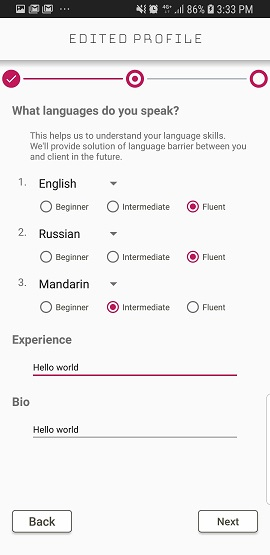

# ModelHub　 　
ModelHub 屬於在台的外國演員和模特兒尋找在台演藝相關工作機會的平台 
未來廣告商或設計師任何有需要外國演員和模特兒需求時，能夠在ModelHub上發案。實現雙平台 
ModelHub目標解決資訊不透明、雙方語言隔閡溝通等問題 

# Featrue
* 主功能
  * 顯示演藝機會列表
  * 點擊進入看到詳細資訊
  * 點擊愛心可收藏機會
  * 分享工作功能
  * 申請功能
  * 註冊功能
  * 登入功能
  
* 篩選
  * 可依照類別或性別篩選

* 收藏頁面
  * 點擊愛心後的收藏會顯示在這頁

* 註冊或登入頁面
  * 若還不是會員，會員功能不會開啟(申請、收藏和編輯個人簡介)

* 個人簡介頁面
  * 點擊相機能拍照或從相簿選取照片當大頭貼
  * 畫面中會顯示使用者的名字和詳細資料
  * 個人作品和簡短自傳以及語言能力會顯示在 INFO Tab
  * WorkBook Tab 開發中
  * 點擊右上角鉛筆可以編輯個人資訊

* 編輯資訊頁面
  * 第一步為基本資料
  * 第二步為語言能力、經歷和自傳
  * 第三步詢問使用者是否要開啟推播功能　(開發中)

# Screenshot
* 首頁畫面

* 進入後點擊任一項目，會直接看到點擊項目的詳細內容

* 個人簡介頁面，顯示基本資料。藍色＂＋＂號按鈕可通過照相或從相簿選取照片更新大頭貼
* 右圖Interests列表為在主頁點擊愛心收藏後的項目

* 編輯個人資料頁面，使用者填寫基本個人資料和語言能力等等

  

# Library
* Retrofit
* indefinitepagerIndicator
* Picasso
* Gson

# Requirement
* Android 8.0 (API 26以上)
* Android Studio 3.0

# Version
* 目前為 Beta 測試版
 

# Contacts
Chloe Hsu  
chloe.thhsu@gmail.com
